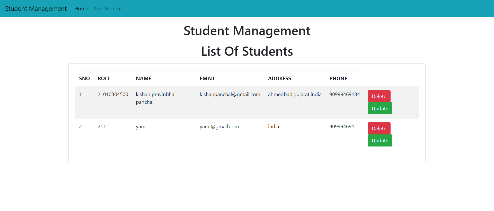

<h1>Student details Management Project </h1>
<h2>In this project i used a python in django framework.I used a CURD operations of d-jango framework</h2>
<h2>How to Project Work shown in below step by step with the Images</h2>

<h3>Step 1: Student managemt project user interface </h3>

<h3>Step 2: You clicked add student then you see the form and fill the form</h3>

<h3>Step 3: After you see the details which you filled with update & delete button</h3>

<h3>Step 4: In this i delete one data </h3>

<h3>Step 5: In this i update a data </h3>

<h3>Step 6: In this i update a data which show you in the student management table. </h3>

